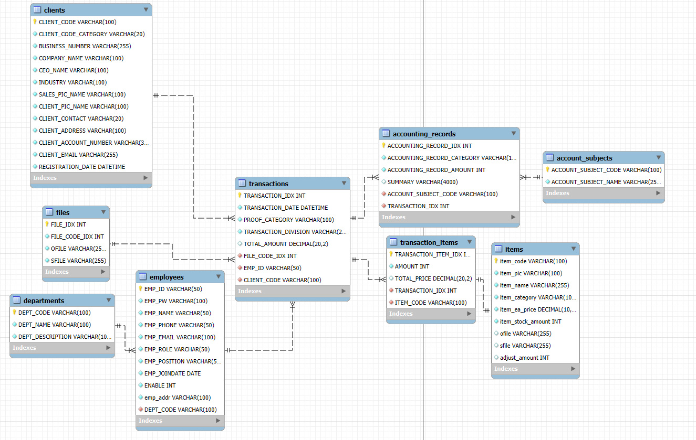
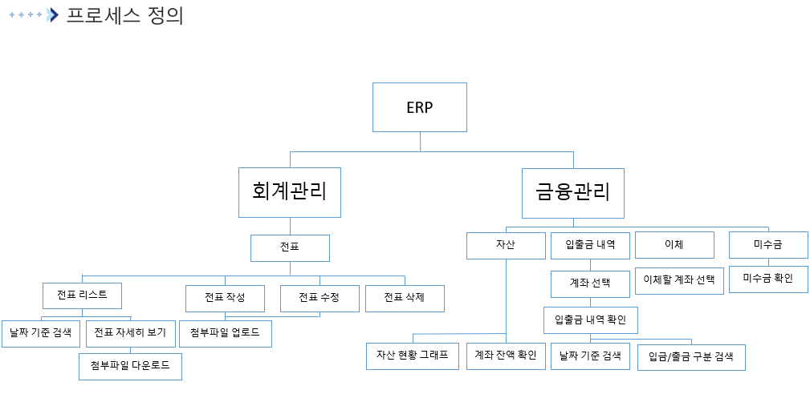
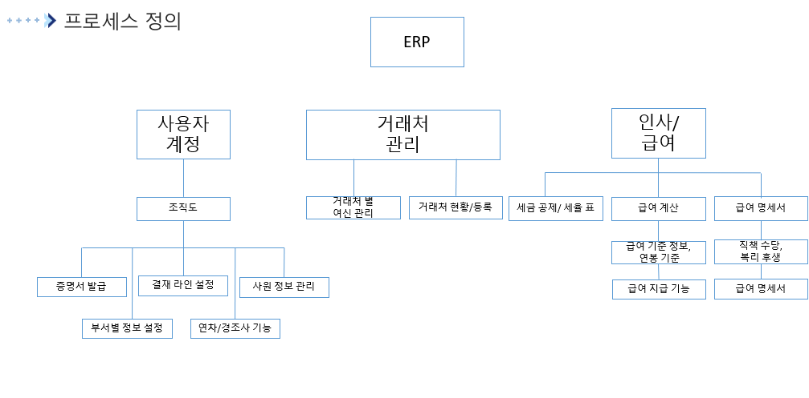

# 🏢 MicroSonic ERP  

**안현준**  

**MicroSonic ERP**는 기업의 **재무, 인사, 자산, 영업, 금융, 재고 관리**를 통합적으로 제공하는 ERP 시스템입니다.  
Spring Boot 기반으로 REST API를 제공하며, React 프론트엔드와 연동되어 **실시간 데이터 관리**가 가능합니다.  

---

## 📅 개발 기간  

- 전표 관리: 2025.08.18 ~ 2025.08.28 [전표 기능 영상 보기](https://youtu.be/-20GCA1JWpw)
- 나머지 기능: 추후 개발 예정  

---

## ⚙️ 기술 스택  

          

---

## 🗂️ 프로젝트 설명  

### 📌 현재 구현된 기능  

#### 💰 회계 관리 (Accounting)  
- 전표 관리 [전표 기능 영상 보기](https://youtu.be/-20GCA1JWpw)

### 📌 추후 개발 예정  

- 로그인 및 권한 관리 (Spring Security)  
- 재고 관리  
  - 품목 관리  
  - 재고 관리  
- 영업 관리  
  - 견적서 관리  
  - 수주서 관리  
  - 거래처 관리  
- 금융 관리  
  - 회사 자산 관리  
  - 입출금 내역 관리  
  - 이체 관리  
  - 미수금 관리  
- 인사 관리  
  - 조직도 관리  
  - 급여 기준 정보 관리  
  - 복리후생 등록  

---

## 📂 프로젝트 구성  

전표 기능 ERD
  

  

프로세스 정의
  

  

---

## 🎬 실행 화면  

실행 화면 보기

전표 화면

### 전표 리스트

### 전표 리스트 검색

### modal창을 이용한 데이터 기입

### 제품 정보 추가

### 분개 추가

### 전표 작성

### 전표 자세히 보기

### 수정으로 Row 삭제

### 멀티파일 업로드

### 파일 다운로드

### 전표 삭제

